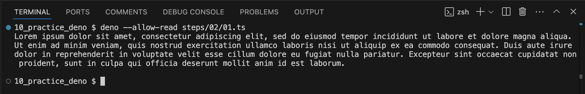
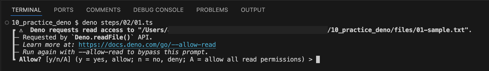
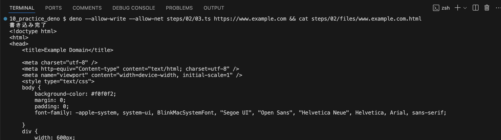

# セキュリティオプションについて

[テキストファイルの内容を標準出力に出力する](./01.ts)
[実行結果](./files/02-write-sample.txt)

注意点1 `--allow-read` 無しで実行すると、警告が出る

注意点2 相対パスはカレントディレクトリが基準になるため、実行時のディレクトリによってはパスを解決できない。

[入力した任意の文字列をファイルに保存する](./02.ts)

注意点1 `--allow-write` 無しで実行すると、警告が出る

[インターネット経由でHTMLを取得し保存する](./03.ts)
[実行結果](./files/www.example.com.html)

注意点1 必要な権限 `allow-net` `allow-write` を全て付与しないと、警告が出る

