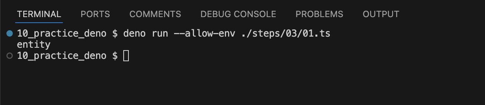

# 3. 外部モジュールを読み込む

[実行スクリプトとは別で関数を定義したスクリプトを用意して実行する](./01.ts)


```ts
import * from '******'
```
import文を使ってパッケージをインストールする。
importの場合は相対パスも参照元のファイルから見たパスになる


[公式が公開しているモジュールを呼び出す](./02.ts)


```
deno add *****
```
コマンドを実行すると [deno.json](../deno.json) に追加したパッケージの情報が記録される。
Denoでは [JSR](https://jsr.io/) からパッケージをインストールする。
