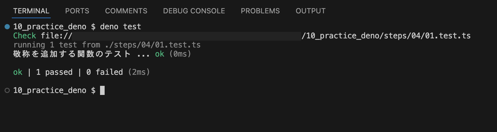

# テストを実行する

[テストコードを実装し、実行する](./01.test.ts)

[参考](https://docs.deno.com/runtime/fundamentals/testing/)
`deno test` を実行した場合、実行ディレクトリ以下にあるファイル名が `{*_,*.,}test.{ts, tsx, mts, js, mjs, jsx}` にマッチするものを対象にする。
