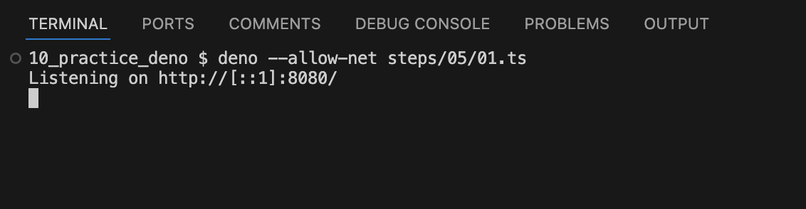
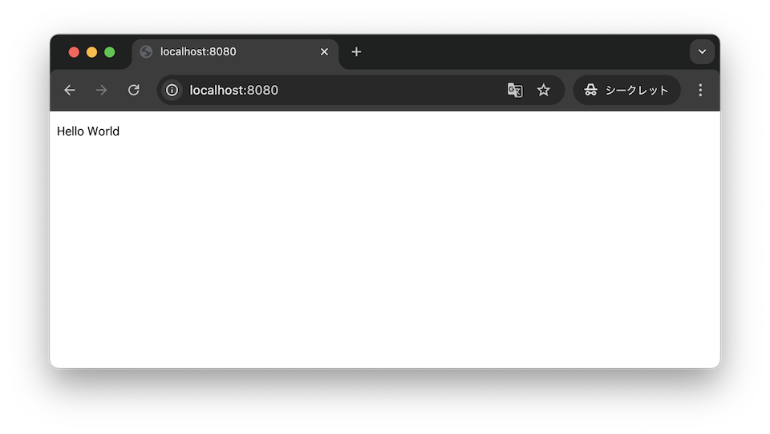
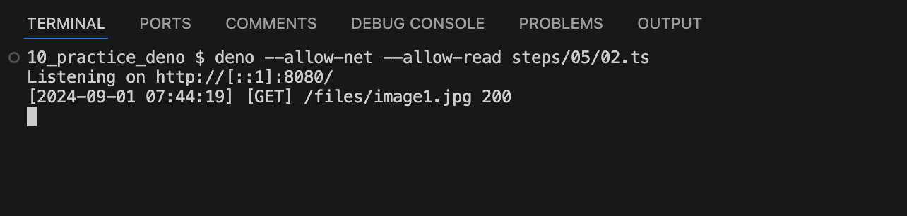
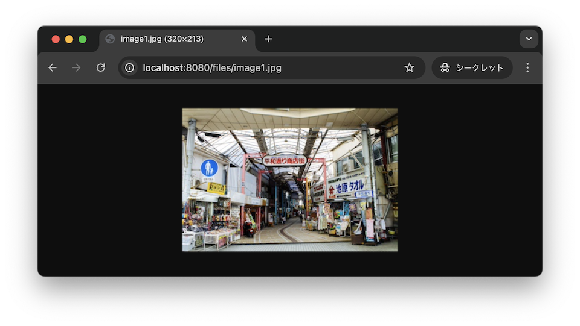
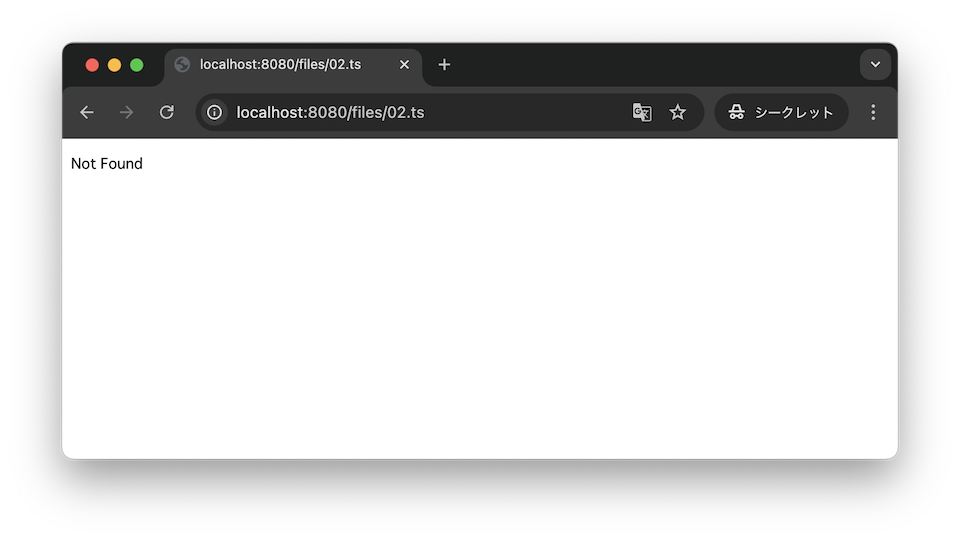

# HTTPサーバーを立ち上げてブラウザでのアクセスを行う

[サーバー起動し localhost:8080 で待機、「Hello World」を出力する](./01.ts)

/ にアクセスすると Hello Worldと返すよう実装

[静的ファイルを返せるようにする](./01.ts)

/files 以下にアクセスした際にファイルを返すようにrouteを定義。
必要以上に参照権限を与えないようにするため、参照可能なディレクトリを static のみに絞り込んだ

static ディレクトリ内のファイルのため参照可能
写真 https://www.pakutaso.com/20190957245post-23022.html

static ディレクトリ以外なので参照不可