# 実施内容

## シンプルなスクリプトを実行する

[「Hello World.」標準出力にを出力する](./01/01.ts)

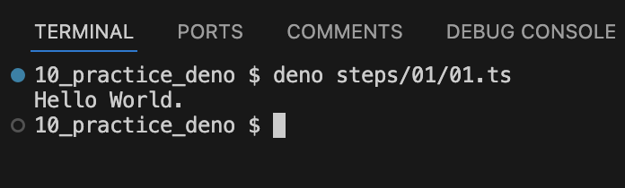

[入力した任意の文字列を標準出力に出力する](./01/02.ts)

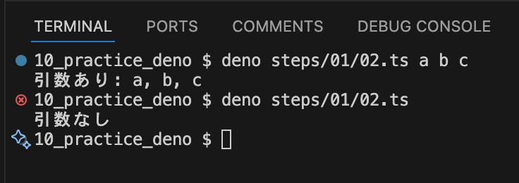

## セキュリティオプションについて

[テキストファイルの内容を標準出力に出力する](./02/01.ts)
[実行結果](./02/files/02-write-sample.txt)

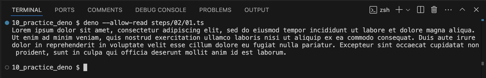

注意点1 `--allow-read` 無しで実行すると、警告が出る

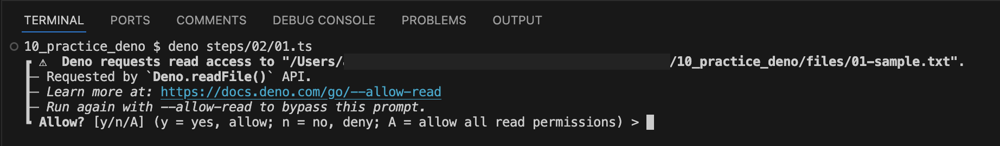

注意点2 相対パスはカレントディレクトリが基準になるため、実行時のディレクトリによってはパスを解決できない。

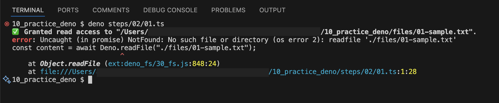

[入力した任意の文字列をファイルに保存する](./02/02.ts)

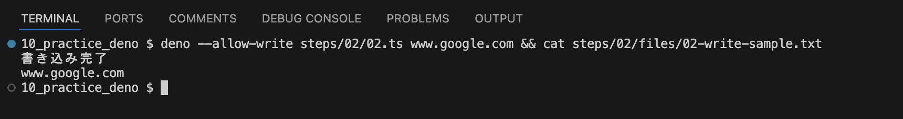

注意点1 `--allow-write` 無しで実行すると、警告が出る

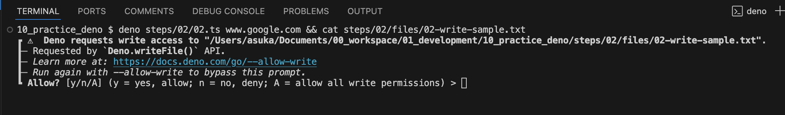

[インターネット経由でHTMLを取得し保存する](./02/03.ts)
[実行結果](./02/files/www.example.com.html)

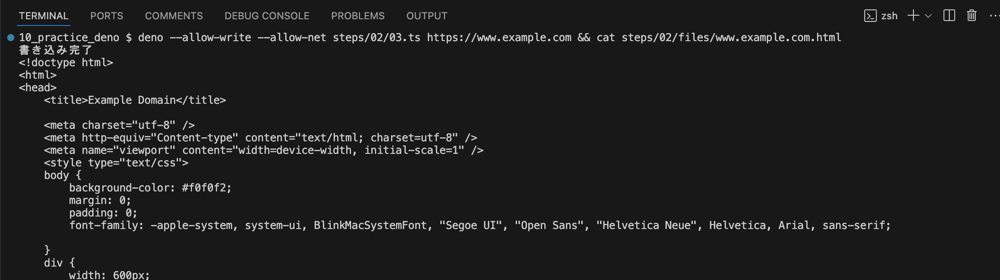

注意点1 必要な権限 `allow-net` `allow-write` を全て付与しないと、警告が出る

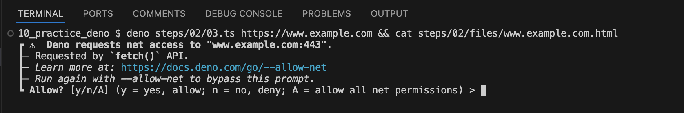
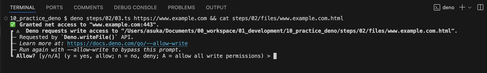

## 3. 外部モジュールを読み込む

[実行スクリプトとは別で関数を定義したスクリプトを用意して実行する](./03/01.ts)
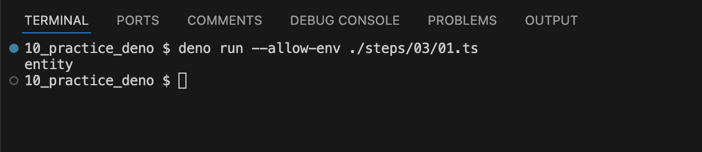

```ts
import * from '******'
```
import文を使ってパッケージをインストールする。
importの場合は相対パスも参照元のファイルから見たパスになる


[公式が公開しているモジュールを呼び出す](./03/02.ts)
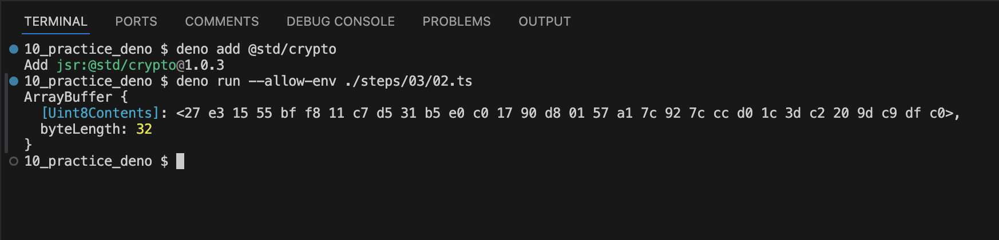

```
deno add *****
```
コマンドを実行すると [deno.json](../deno.json) に追加したパッケージの情報が記録される。
Denoでは [JSR](https://jsr.io/) からパッケージをインストールする。

## テストを実行する

[テストコードを実装し、実行する](./04//01.test.ts)

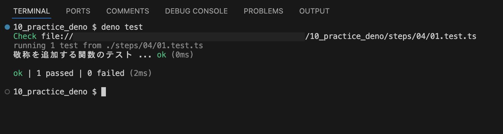

[参考](https://docs.deno.com/runtime/fundamentals/testing/)
`deno test` を実行した場合、実行ディレクトリ以下にあるファイル名が `{*_,*.,}test.{ts, tsx, mts, js, mjs, jsx}` にマッチするものを対象にする。
